# chakra_replay_checkpoint
extend chakra with checkpointing recording and simulation

How to Use
1. Import the Checkpoint Hook

In your training or profiling script, import the checkpoint hook utilities:

from checkpoint_hook import setup_checkpoint_hooks, flush_checkpoint_metadata

2. Set Up and Flush Checkpoint Hooks

Initialize the checkpoint hooks once per rank before training starts:

setup_checkpoint_hooks(rank)

After training (or at the end of profiling), flush the recorded checkpoint metadata:

flush_checkpoint_metadata(rank)

3. Replace Chakra and ET-Replay

Use the patched versions of Chakra and ET-Replay that include checkpoint support.

Replace your existing Chakra installation with the extended version

Replace ET-Replay with the modified replay engine that supports CHECKPOINT_NODE

4. Run Using the New CLI

Use the updated command-line interface defined in:

full_run_cli

## Demo

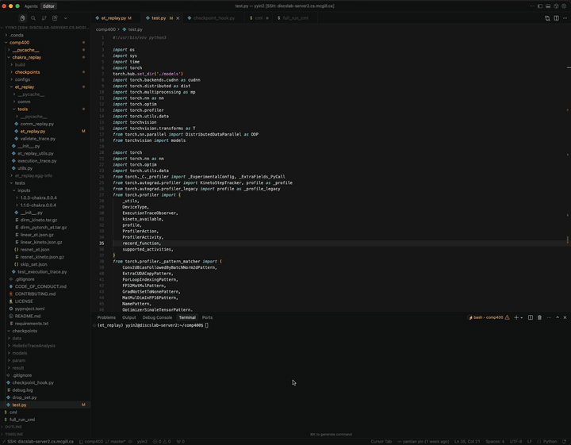
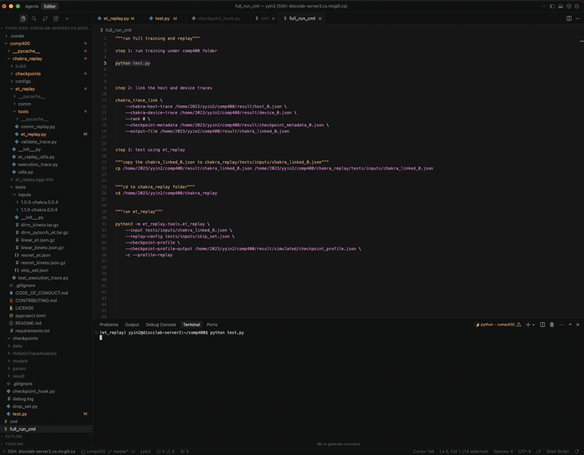
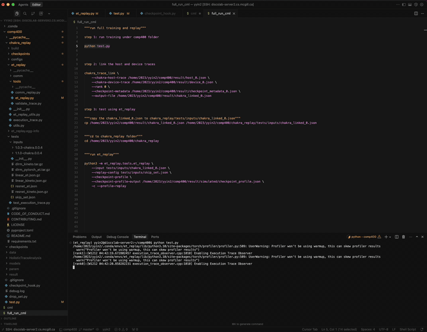
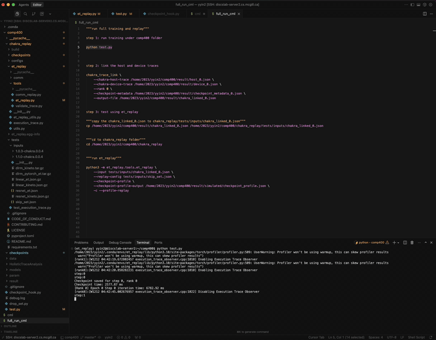
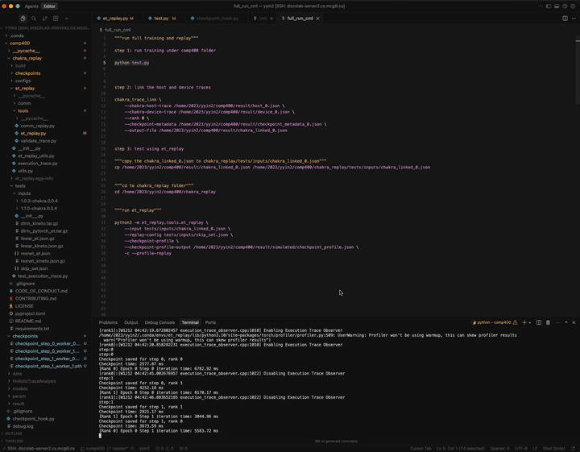
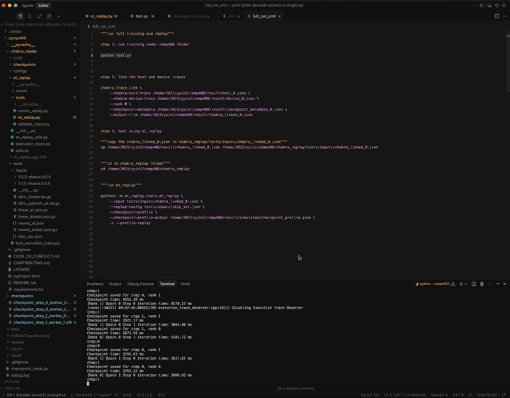
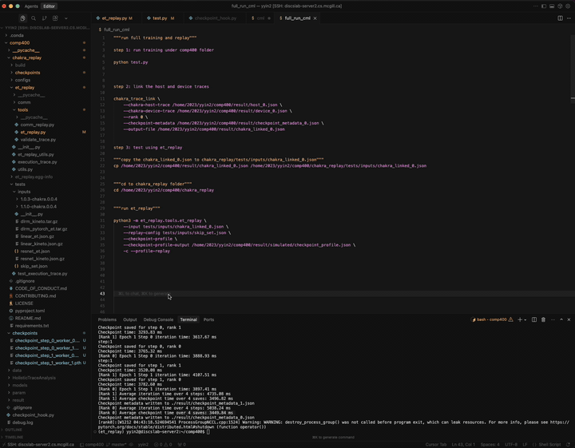
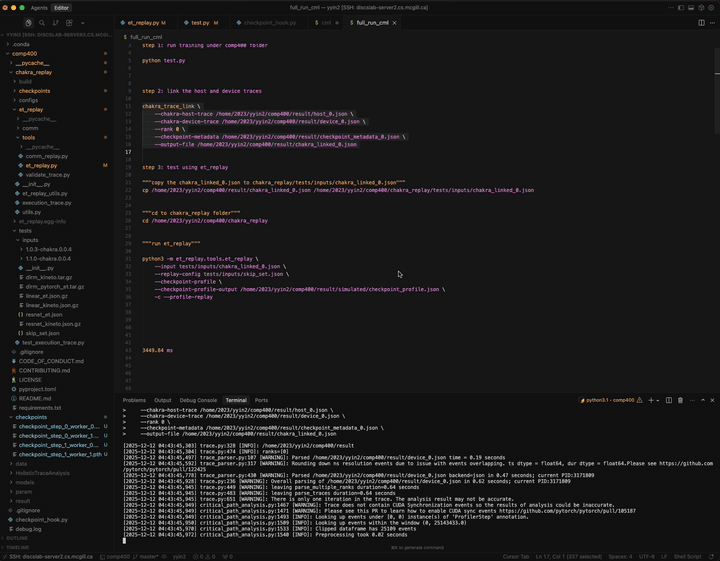
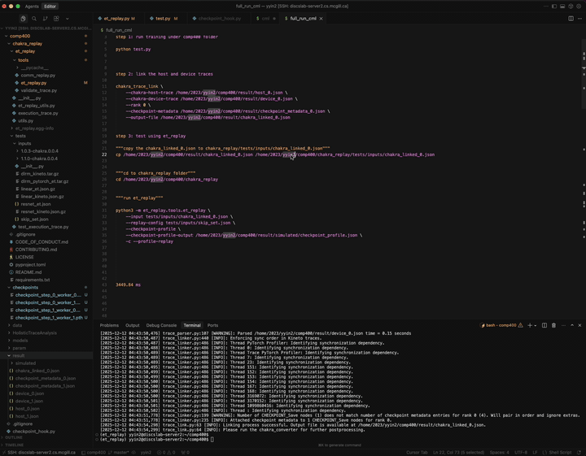
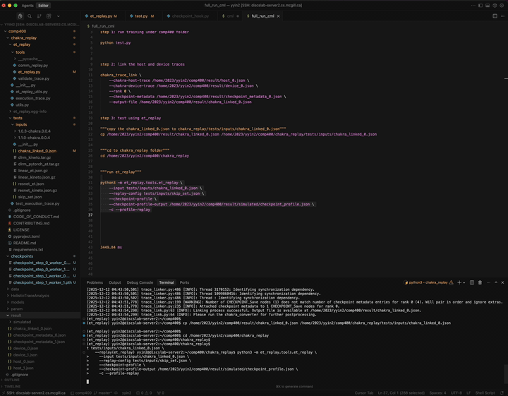
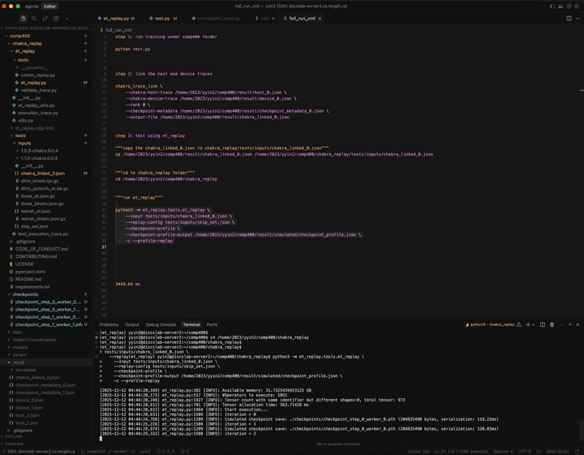
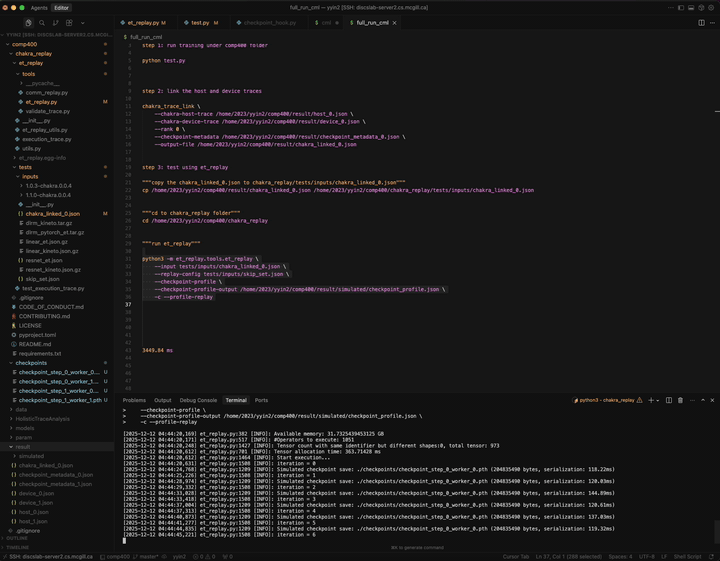
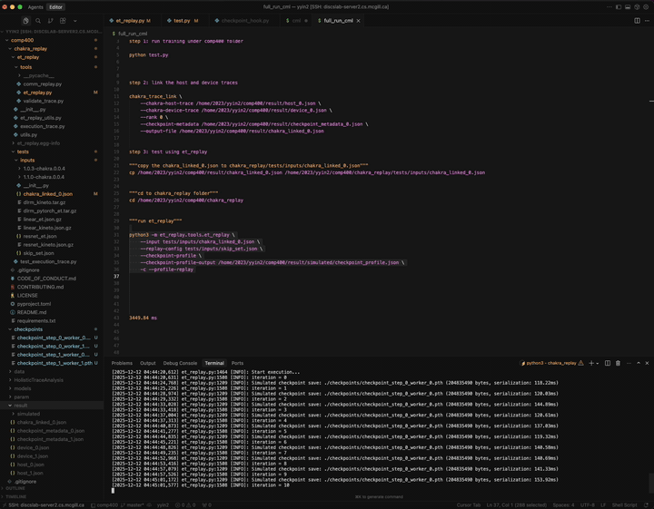

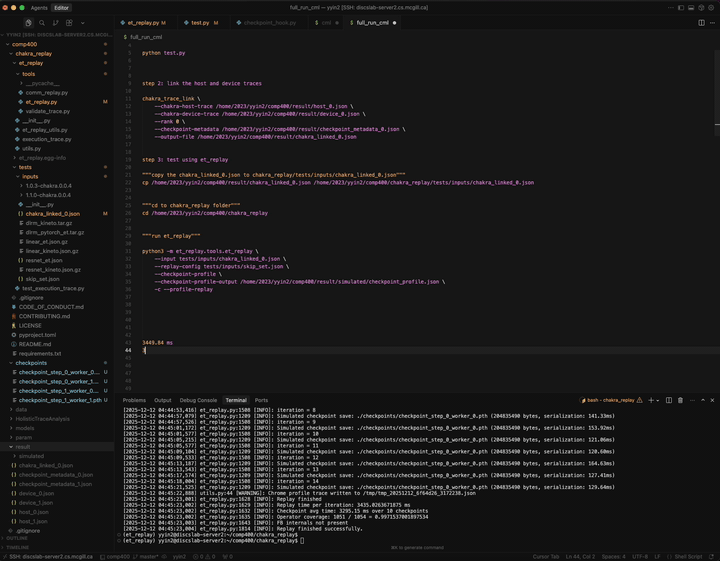
